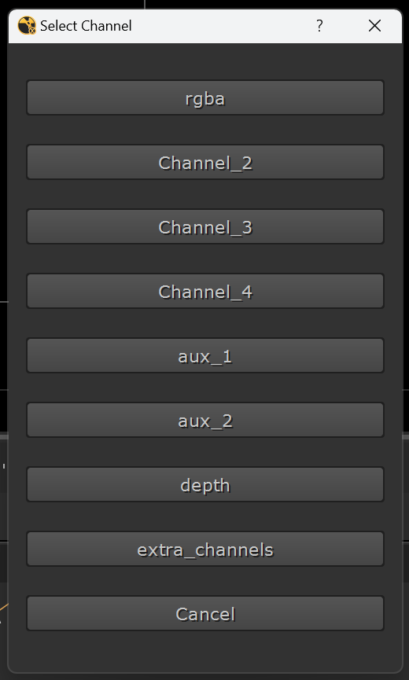
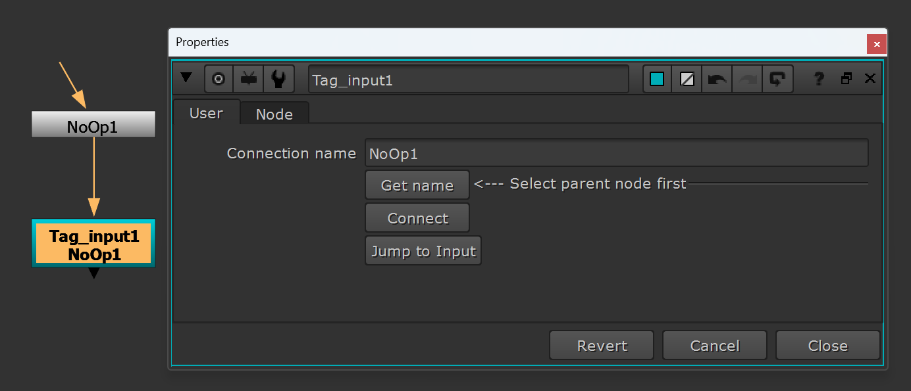
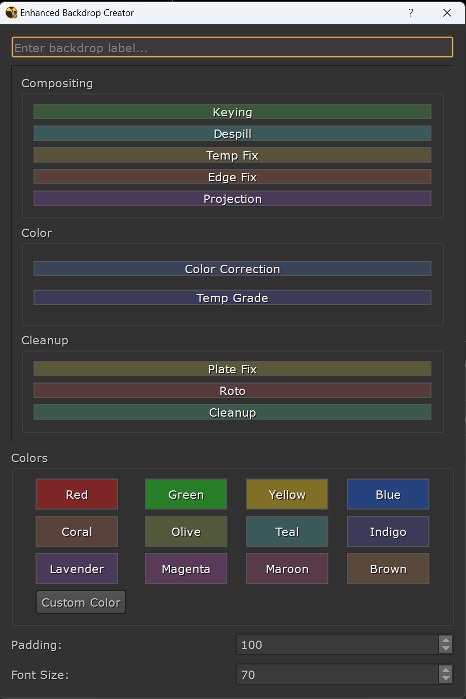
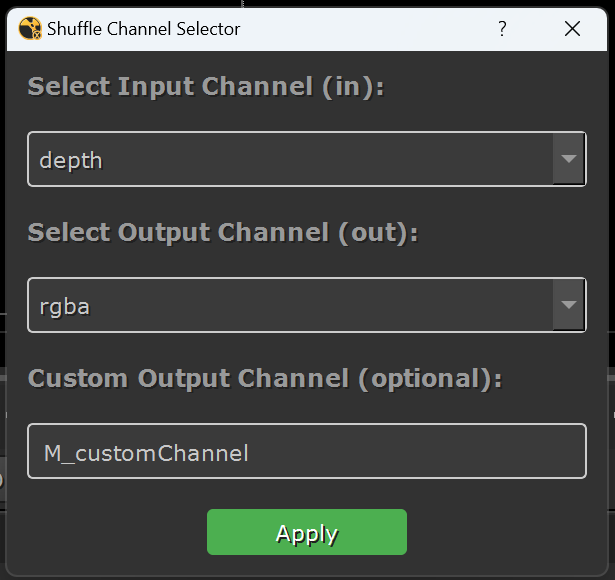

# Nuke Workflow Tools by Vikas Kaushal

A collection of Python scripts to enhance compositing efficiency in Nuke. These tools provide intuitive GUIs and automation for managing channels, tagging nodes, and organizing backdrops, designed to streamline your workflow.

## Overview

This repository includes:

* **Shuffle Shift**: Simplifies channel selection for `Shuffle` and `Shuffle2` nodes with a button-based GUI.
* **Tag Input Node**: Automates creation and connection of custom `Tag_Input` nodes for easy node tracking.
* **Backdrop Inator**: Creates customizable backdrops with an interactive UI and color picker.
* **Shuffle Dropdown**: Enhances channel management for `Shuffle` and `Shuffle2` nodes with dropdowns and custom channel creation.

## Installation

### Step 1: Copy Scripts to Nuke Directory

1.  Place all script files (`shuffle_shift.py`, `tag_input.py`, `V_backdrop_inator.py`, `V_shuffle_dropdown.py`) in your `.nuke/python` directory:
    * **Windows**: `C:\Users\<YourUsername>\.nuke\python`
    * **macOS/Linux**: `~/.nuke/python`
2.  If the `python` folder doesn’t exist, create it.

### `Step 2: Update init.py`

Ensure Nuke loads the scripts by adding the `python` folder to the plugin path:

1.  Open or create `init.py` in your `.nuke` directory.
2.  Add:

    ```python
    import nuke
    nuke.pluginAddPath("./python")
    ```

### `Step 3: Update menu.py`

Add all tools to a custom Nuke menu:

1.  Open or create `menu.py` in your `.nuke` directory.
2.  Add:

    ```python
    import nuke
    import shuffle_shift
    import tag_input
    import V_backdrop_inator
    import V_shuffle_dropdown
    
    # Create custom menu
    menubar = nuke.menu("Nuke")
    v_commands = menubar.addMenu("V_commands")
    
    # Add tool commands
    v_commands.addCommand("Shuffle Shift", "shuffle_shift.select_channel_for_shuffle()", "Alt+`")
    v_commands.addCommand("Tag Input Node", "tag_input.create_tag_input_node()", "Alt+T")
    v_commands.addCommand("Create Backdrop", "V_backdrop_inator.launch_backdrop_creator()", "Ctrl+Alt+B")
    v_commands.addCommand("Shuffle Dropdown", "V_shuffle_dropdown.create_shuffle_ui()", "Ctrl+Shift+S")
    ```
3.  Save and restart Nuke.

## Tools

### 1. Shuffle Shift

Simplifies channel selection for `Shuffle` and `Shuffle2` nodes with a button-based interface.

#### Features

* Lists all available channels dynamically.
* Prioritizes `rgb`, `rgba`, and `alpha` in the UI.
* Supports both `Shuffle` and `Shuffle2` nodes.
* Includes a Cancel button to exit without changes.

#### Usage

1.  Select a `Shuffle` or `Shuffle2` node.
2.  Launch via `V_commands -> Shuffle Shift` or `Alt+`.
3.  Click a channel button to assign it.
4.  Click Cancel to close without changes.

#### Preview


---

### 2. Tag Input Node

Automates creation of `Tag_Input` nodes to tag and connect to parent nodes, improving node graph navigation.

#### Features

* Generates unique node names (e.g., `Tag_input1`).
* Fetches and displays the selected node’s name.
* Connects the `Tag_Input` node to the parent.
* Includes a `Jump to Input` button to zoom to the parent node.

#### Usage

1.  Run via `V_commands -> Tag Input Node` or `Alt+T`.
2.  Select a node, click `Get Name` to display its name.
3.  Click `Connect` to link the `Tag_Input` node.
4.  Use `Jump to Input` to navigate to the parent.

#### Preview


---

### 3. Backdrop Inator

Creates customizable backdrops with an interactive UI and color picker for better node graph organization.

#### Features

* Offers buttons for quick backdrop creation.
* Includes a color picker for custom colors.
* Built with Qt for a user-friendly experience.

#### Usage

1.  Launch via `V_commands -> Create Backdrop` or `Ctrl+Alt+B`.
2.  Use the UI to set backdrop properties and colors.
3.  Apply to create the backdrop in the node graph.

#### Preview


---

### 4. Shuffle Dropdown

Enhances channel management for `Shuffle` and `Shuffle2` nodes with dropdowns and custom channel creation.

#### Features

* Lists input channels dynamically, defaulting to current `in`/`in1` and `out`/`out1` values.
* Supports creating custom output channels with RGBA sub-channels.
* Fallback to `rgba` for output if unset.
* Compatible with old (`Shuffle`) and new (`Shuffle2`) nodes.
* Clean GUI with dropdowns and a custom channel text field.

#### Usage

1.  Select a `Shuffle` or `Shuffle2` node.
2.  Launch via `V_commands -> Shuffle Dropdown` or `Ctrl+Shift+S`.
3.  Choose input/output channels from dropdowns or enter a custom output channel.
4.  Click `Apply` to update the node.

#### Preview


---

## Requirements

* **Nuke**: Version 11 and above (tested up to Nuke 15).
* **Python**: Compatible with Nuke’s built-in Python (2.7+ or 3.7+, depending on version).
* **PySide2**: Included with Nuke; no external installation needed.

## Contributing

Contributions are welcome! To contribute:

1.  Fork the repository.
2.  Create a branch: `git checkout -b feature-name`
3.  Commit changes: `git commit -m "Add feature"`
4.  Push: `git push origin feature-name`
5.  Open a pull request.

## Author

Developed by **Vikas Kaushal**.

## License

This project is licensed under the MIT License.

## Contact

For questions or issues, reach out via GitHub issues or submit a pull request