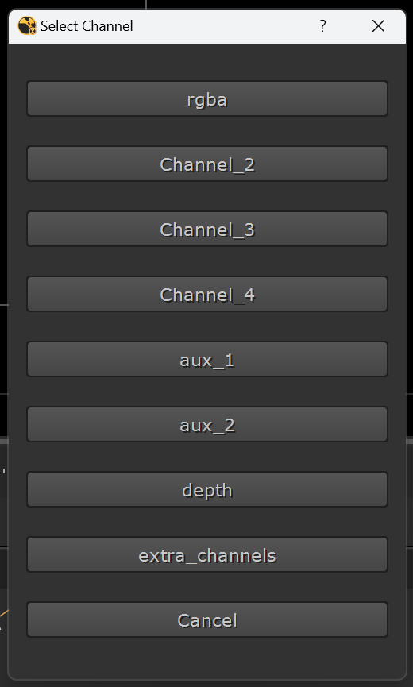

# **Shuffle Shift: Nuke Channel Selector for Shuffle Nodes**

A Python script leveraging PySide2 to simplify channel selection for `Shuffle` and `Shuffle2` nodes in Nuke. This tool enhances workflow efficiency by providing an intuitive GUI for channel selection.

---

## **Features**

- **Dynamic Channel Retrieval**: Automatically lists all available channels in the selected node.
- **Prioritized Sorting**: Channels like `rgb`, `rgba`, and `alpha` appear first, followed by others alphabetically.
- **Interactive GUI**: Buttons for each channel and a "Cancel" option for easy navigation.
- **Supports Multiple Node Types**: Compatible with both `Shuffle` and `Shuffle2` nodes.

---

## **Installation**

### **Step 1: Clone or Download the Repository**
Clone or download this repository:
```bash
git clone https://github.com/your-username/shuffle_shift.git
```

### **Step 2: Copy Script to the Nuke Directory**
1. Move the script (`shuffle_shift.py`) to your `.nuke/python` directory:
   - **Windows**: `C:\Users\<YourUsername>\.nuke\python`
   - **Linux**: `/home/<YourUsername>/.nuke/python`

2. If the `python` folder doesn’t exist, create it manually.

---

### **Step 3: Update `menu.py`**

To install the script into Nuke's menu with your preferred setup:

1. Open (or create) your `menu.py` file in the `.nuke` directory:
   - **Windows**: `C:\Users\<YourUsername>\.nuke\menu.py`
   - **Linux**: `/home/<YourUsername>/.nuke/menu.py`

2. Add the following code to include the tool in Nuke's menu:

```python
import nuke
import shuffle_shift

# Create a custom menu in Nuke
menubar = nuke.menu("Nuke")
v_commands = menubar.addMenu("V_commands")

# Add the Shuffle Shift command to the menu
v_commands.addCommand("Shuffle Shift", lambda: shuffle_shift.select_channel_for_shuffle(), "Alt+`")
```

3. Save the file and restart Nuke.

---

## **Usage**

1. **Select a Node**:
   - Select a `Shuffle` or `Shuffle2` node in Nuke's Node Graph.

2. **Launch the Tool**:
   - Access **Shuffle Shift** from the **"V_commands"** menu in Nuke's toolbar.
   - Or use the shortcut "Alt+`".

3. **Choose a Channel**:
   - A dialog with buttons for each channel appears.
   - Click a button to assign the channel to the node.

4. **Cancel Operation**:
   - Click "Cancel" to close the dialog without making changes.

---

## **Requirements**

- **Nuke**: Version 11 and above.
- **Python**: Version 2.7+ or 3.7+ (depends on your Nuke version).
- **PySide2**: Install using:
  ```bash
  pip install PySide2
  ```

---

## **How It Works**

### **Key Components**
- **Channel Retrieval**:
  The `get_channels()` method extracts all unique base layer names from the node's channels.

- **Custom Sorting**:
  Channels are sorted with `rgb`, `rgba`, and `alpha` prioritized, followed by others alphabetically.

- **Interactive GUI**:
  The `ChannelButtonPanel` class creates a dialog with buttons for each channel.

---

## **Preview**




---

## **Future Enhancements**

- Add search functionality for large channel lists.
- Extend support for additional node types.
- Allow customization of priority channels.

---

## **Contributing**

Contributions are welcome! Follow these steps:

1. Fork this repository.
2. Create a new branch:
   ```bash
   git checkout -b feature-name
   ```
3. Commit your changes:
   ```bash
   git commit -m "Add new feature"
   ```
4. Push the branch:
   ```bash
   git push origin feature-name
   ```
5. Open a pull request.

---

Thanks!
